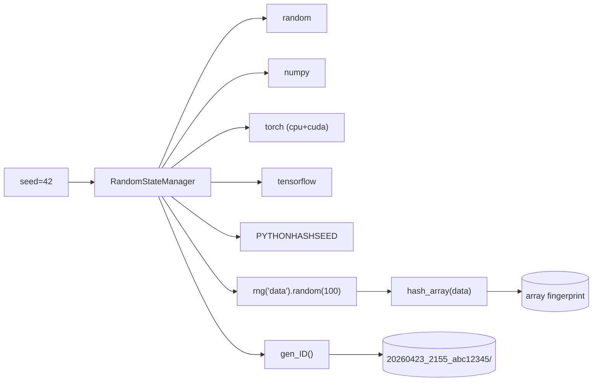
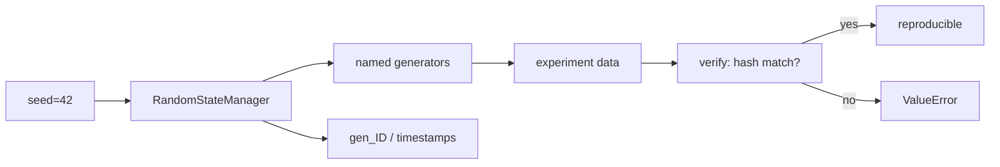

# scitex-repro

<p align="center">
  <a href="https://scitex.ai">
    
  </a>
</p>

<p align="center"><b>Reproducibility utilities — RNG seeding, ID generation, timestamps, array hashing.</b></p>

<p align="center">
  <a href="https://scitex-repro.readthedocs.io/">Full Documentation</a> · <code>uv pip install scitex-repro[all]</code>
</p>

<!-- scitex-badges:start -->
<p align="center">
  <a href="https://pypi.org/project/scitex-repro/"></a>
  <a href="https://pypi.org/project/scitex-repro/"></a>
  <a href="https://github.com/ywatanabe1989/scitex-repro/actions/workflows/rtd-sphinx-build-on-ubuntu-latest.yml"></a>
  <a href="https://scitex-repro.readthedocs.io/en/latest/"></a>
</p>
<p align="center">
  <a href="https://github.com/ywatanabe1989/scitex-repro/actions/workflows/pytest-matrix-on-ubuntu-py3-11-3-12-3-13.yml"></a>
  <a href="https://github.com/ywatanabe1989/scitex-repro/actions/workflows/import-smoke-on-ubuntu-py3-12.yml"></a>
  <a href="https://codecov.io/gh/ywatanabe1989/scitex-repro"></a>
</p>
<!-- scitex-badges:end -->

---

## Problem and Solution

| # | Problem | Solution |
|---|---------|----------|
| 1 | **"Seed everything" takes 5+ lines** — `random` + `numpy` + `torch` (cpu+cuda) + `tensorflow` + `PYTHONHASHSEED` | **`RandomStateManager(seed=42)`** — one call seeds every framework detected in the env; `.reset()` rewinds mid-experiment |
| 2 | **Run directories collide** — two parallel runs overwrite each other | `gen_ID()` + `hash_array()` — unique names like `20260423_2155_abc12345`; deterministic fingerprints for integrity checks |

## Quick Start

```python
from scitex_repro import RandomStateManager, gen_ID, hash_array

rng = RandomStateManager(seed=42)
data = rng("data").random(100)
print(gen_ID(), hash_array(data))
```

## Demo



<p align="center"><sub><b>Figure 1.</b> Demo. One seed fans out to every framework; IDs and fingerprints track each run.</sub></p>

## Installation

```bash
uv pip install "scitex-repro[all]"
```

<details>
<summary><strong>Extras</strong></summary>

| Extra | Enables |
|-------|---------|
| `all` | Every framework seed (`jax` + `tensorflow` + `torch`) |
| `jax` | JAX seeding (`jax`, `jaxlib`) |
| `tensorflow` | TensorFlow seeding (`tensorflow`) |
| `torch` | PyTorch seeding (`torch`) |
| `dev` | Test/lint tools (`pytest`, `ruff`, `scitex-dev`) |
| `docs` | Sphinx build (`sphinx`, theme/parser extensions) |

</details>

## Architecture



<p align="center"><sub><b>Figure 2.</b> Architecture. Seeded generators produce data; verify() compares hashes against the cache.</sub></p>

## 1 Interfaces

<details open>
<summary><strong>Python API</strong></summary>

<br>

```python
from scitex_repro import RandomStateManager, gen_ID, hash_array

# Cross-framework RNG seeding
rng = RandomStateManager(seed=42)
data = rng("data").random(100)
rng.verify(data, "my_data")
rng.reset()

# Deterministic IDs and array fingerprints
exp_id = gen_ID()                         # "20260423_2155_abc12345"
fingerprint = hash_array(data)
```

</details>

## Part of SciTeX

`scitex-repro` is part of [**SciTeX**](https://scitex.ai). Install via
the umbrella with `pip install scitex[repro]` to use as
`scitex.repro` (Python) or `scitex repro ...` (CLI).

>Four Freedoms for Research
>
>0. The freedom to **run** your research anywhere — your machine, your terms.
>1. The freedom to **study** how every step works — from raw data to final manuscript.
>2. The freedom to **redistribute** your workflows, not just your papers.
>3. The freedom to **modify** any module and share improvements with the community.
>
>AGPL-3.0 — because we believe research infrastructure deserves the same freedoms as the software it runs on.

## License

AGPL-3.0-only (see [LICENSE](./LICENSE)).

---

<p align="center">
  <a href="https://scitex.ai" target="_blank"></a>
</p>
